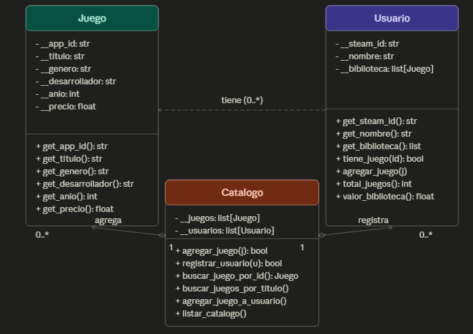

# BibliotecaSteam - Sistema de Gestión de Videojuegos

**Trabajo Práctico Final - Testing de Software**  
**Universidad de Belgrano** - Técnico en Programación de Computadoras

---

## 1.1 Descriptivo del Software

**Objetivo del Software:**  
Desarrollar un sistema simple orientado a objetos para la gestión de una biblioteca de videojuegos estilo Steam, permitiendo el registro de juegos y usuarios, la administración de bibliotecas personales y la búsqueda de juegos con las validaciones correspondientes.

**Requerimientos Funcionales Implementados:**

* Alta de Juegos al catálogo
* Búsqueda de juegos por título
* Búsqueda de juegos por género
* Listado completo del catálogo
* Registro de Usuarios 
* Listado de usuarios con total de juegos y valor de su biblioteca
* Ver biblioteca personal de un usuario
* Agregar un juego del catálogo a la biblioteca de un usuario

**Requerimientos No Funcionales:**

* Desarrollado en Python 3 con Programación Orientada a Objetos
* Interfaz por consola
* Código modular

---

## 1.3 Artefactos UML



---

## 1.4 Link al Repositorio

**Repositorio GitHub:**  
https://github.com/Fran30IwI/TPFINAL

### Cómo ejecutar el programa

- Descargás o copiás el repositorio
- Lo abrís en la terminal o en el editor de código
- Ejecutás el main.py

```bash
python main.py
```

El sistema inicia con **8 juegos** y **2 usuarios** precargados hacer mas facil el probar el codigo.

##  PRUEBAS

### Pruebas Unitarias
Verifican individualmente cada clase y método.

### Pruebas de Integración
Comprueban la interacción entre módulos.

### Pruebas de Caja Negra
Validan entradas y salidas esperadas.

### Pruebas E2E
Simulan el flujo completo de uso del sistema.

## Ejecución

python -m unittest test_biblioteca.py